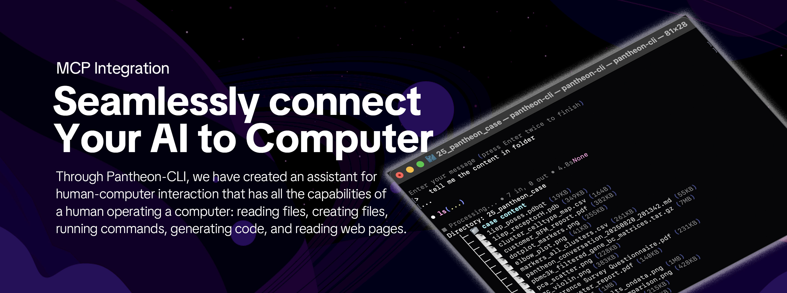
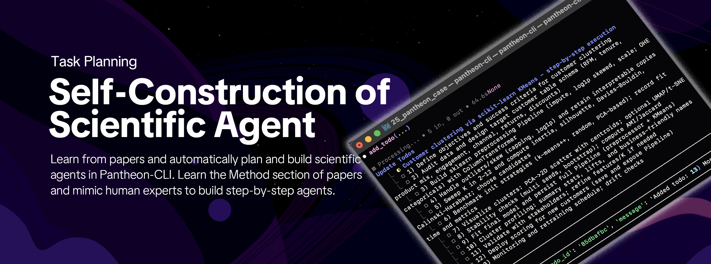
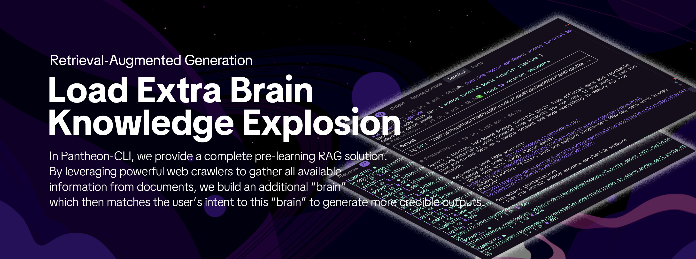
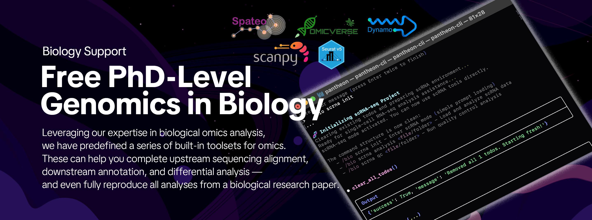

<!-- Banner -->
<p align="center"><a name="readme-top"></a>
  
  


</p>

<div align="center">

# Pantheon CLI

***We're not just building another CLI tool.  
We're defining how scientists interact with data in the AI era.***

**The first fully open-source, infinitely extensible scientific "chat analysis" human like framework**

**English** · [简体中文](./README.zh-CN.md) · [Official Site][official-site] · [Changelog][changelog] · [Documents][docs] · [Blog][blog] · [Feedback][github-issues-link]

[official-site]: https://pantheonos.stanford.edu/
[changelog]: https://pantheonos.stanford.edu/cli/docs/release-notes
[docs]: https://pantheonos.stanford.edu/cli/docs/intro/getting-started
[blog]: https://pantheonos.stanford.edu/news

</div>

<div align="center">

<!-- SHIELD GROUP -->

[![][github-release-shield]][github-release-link]
[![][vercel-shield]][vercel-link]
[![][discord-shield]][discord-link]<br/>
[![][github-contributors-shield]][github-contributors-link]
[![][github-forks-shield]][github-forks-link]
[![][github-stars-shield]][github-stars-link]
[![][github-issues-shield]][github-issues-link]
[![][github-license-shield]][github-license-link]<br>


<table align="center" width="100%" style="border: none; border-collapse: collapse; margin: 30px 0;">
<tr>
<td width="50%" align="center" style="vertical-align: top; padding: 20px;">

#### 🖥️ **CLI Interface**
**Terminal-Based Development**

<div align="center">

  

  <div style="background: linear-gradient(135deg, #2D3748 0%, #4A5568 100%); border-radius: 12px; padding: 15px; margin: 15px 0; color: white;">
    <strong>Scientific Terminal Experience</strong><br/>
    <small>All Claude Code Function<br/>Analyst-friendly interface<br/>Real-time progress tracking</small>
  </div>

  *Open-source CLI built for collaborative analysis, local-first execution, and seamless integration with modern DevOps.*
</div>

</td>
<td width="50%" align="center" style="vertical-align: top; padding: 20px;">

#### 🌐 **Notebook Interface**
**Notebook Interactive Experience**

<div align="center">

  

  <div style="background: linear-gradient(135deg, #0EA5E9 0%, #00D4FF 100%); border-radius: 12px; padding: 15px; margin: 15px 0; color: white;">
  <strong>📓 Interactive Notebook Integration</strong><br/>
  <small>Step-by-step execution<br/>Real-time visualization<br/>Seamless CLI integration</small>
</div>


  *Pantheon-CLI meets JupyterLab—bridging natural language, code, and data in one unified notebook experience.*
</div>

</td>
</tr>
</table>

**Share Pantheon-CLI Repository**

[![][share-x-shield]][share-x-link]
[![][share-telegram-shield]][share-telegram-link]
[![][share-whatsapp-shield]][share-whatsapp-link]
[![][share-reddit-shield]][share-reddit-link]
[![][share-weibo-shield]][share-weibo-link]
[![][share-mastodon-shield]][share-mastodon-link]
[![][share-linkedin-shield]][share-linkedin-link]


[](https://www.python.org/downloads/)
[]()
[]()


</div>


## `1` [What is Pantheon-CLI?](#1-what-is-pantheon-cli)

Pantheon-CLI is the **first fully open-source "chat analysis" human-like framework** built specifically for scientific research. We are defining a new way for researchers to interact with data in the AI era.

### **PhD-Level Scientific Assistant**
- Pantheon-CLI is the first command-line intelligent (CLI) agent assistant for complex real-world analysis like human, capable of handling PhD-level single-cell and spatial genomics tasks. This is not just a tool—**it's an AI scientist on your research team**.

### **Mixed Programming** 
- With Pantheon-CLI, you can work within the same environment to:
  - Write Python code on the first line
  - Use natural language descriptions on the next line  
  - Even mix in R/Julia languages

All scientists need only focus on the **explore**, without switching between different tools and environments.

## `2` [Quick Start & Join our Community](#)

We are a group of scientist-engineers, building the first open-source Python-based CLI that redefines how humans interact with data. By embracing an Agent-driven, conversational workflow, Pantheon-CLI aims to provide researchers and developers across disciplines with a more transparent, reproducible, and future-proof ecosystem for data science.

Whether you are a biologist, financial analyst, social scientist, or machine learning researcher, Pantheon-CLI will be your next-generation playground for analysis. Please note that Pantheon-CLI is still under active development, and we warmly welcome your feedback and contributions.

| [](https://pypi.org/project/pantheon-cli)   | `pip install 'pantheon-cli[notebook]'`                           |
| :---------------------------------------- | :----------------------------------------------------------------------------------------------------------------- |
| [![][slack-shield-badge]]([slack-link]](https://join.slack.com/t/pantheonos/shared_invite/zt-3bmj318fo-vAWtJA01VkcqyHsleduFjQ))             | Join our Slack community! Connect with developers and other enthusiastic users of Pantheon. |
| [![][discord-shield-badge]](https://discord.com/invite/74yzAGYW)        | Join our Discord community! Connect with developers and other enthusiastic users of Pantheon. |

[slack-shield-badge]: https://img.shields.io/badge/Slack-join-blue?logo=slack&style=flat-square  
[slack-link]: https://pantheonos.slack.com/ssb/redirect  

[discord-shield-badge]: https://img.shields.io/badge/Discord-join-blue?logo=discord&style=flat-square  
[discord-link]: https://discord.com/invite/74yzAGYW  

## `3` [Features](#)

Transform your data analysis workflow with Pantheon-CLI’s open-source power, built for seamless language integration, effortless data analysis, and next-generation discovery.

### 3.1 Chat with Data


- With Pantheon-CLI, you can process any local data, not limited to text csv, excel, including anndata, pkl, torch, and any other Python/R/Julia-supported data formats. 
- You don’t need to upload any data to a server—the analysis power depends entirely on your own computer. You can even install Pantheon-CLI on a server to unlock unlimited possibilities for data analysis.

### 3.2 Mixed Programming


- In Pantheon-CLI, all variables are kept in the environment. We have broken through the limitations of 
traditional programming. You can enter natural language at any time to program, and the CLI will automatically generate Python/R/Julia code to run.
- This is the world’s first Agent CLI with variable support. During the coding process, you can input natural language at any time, and Pantheon-CLI will automatically carry out any analysis you want.

### 3.3 MCP Integration



- Through Pantheon-CLI, we have created an assistant for human-computer interaction that has all the capabilities of a human operating a computer: reading files, creating files, running commands, generating code, and reading web pages.
- Unlike traditional agents, we have implemented nearly all the functionalities of Claude Code and further optimized them—aiming to make Pantheon-CLI better suited for data analysis rather than pure code programming.

### 3.4 Human Behavious


- In Pantheon-CLI, it can read web tutorials and PDF papers, just like human scientists do before analyzing data in a specific field. Then it can start planning the analysis.
- Feeding documents or tutorials into GPT often leads to better outputs, but not all web content is accessible. We have redesigned a more powerful web fetch feature to replicate, as closely as possible, everything a human would do before analyzing data.

### 3.5 Task Planning



- Learn from papers and automatically plan and build scientific agents in Pantheon-CLI. Learn the Method section of papers and mimic human experts to build step-by-step agents.
- For a data science task, the common approach for Agents today is to plan and execute step by step. However, this relies on steps predefined by humans. In Pantheon-CLI, it automatically learns and plans the analysis workflow from papers or tutorials. How is that any different from how humans do it?

### 3.6 Multi AI Provider


- Pantheon-CLI supports major LLM providers, including OpenAI, Anthropic, Gemini, Deepseek, Qwen, and more, so you are not limited to any particular model.
- This may look simple, but it’s a highly practical feature: we support all major large models, without requiring a Claude Code–style API—any LLM API is supported.

### 3.7 Local LLM Support


- To account for certain data privacy compliance requirements, Pantheon-CLI can analyze data completely offline using a local large model based on open sourced models, such as deepseek, ollama or gpt-oss.
- Analyze data and run model locally as an important advantage of Pantheon-CLI.

### 3.8 Multi RAG Suport



- In Pantheon-CLI, we provide a complete pre-learning RAG solution. By leveraging powerful web crawlers to gather all available information from documents, we build an additional “brain” which then matches the user’s intent to this “brain” to generate more credible outputs.
- Although RAG is still subject to much debate, people can’t always find the right tutorial to use as accurate input. In such cases, RAG becomes highly valuable—after all, extremely long contexts also consume a lot of tokens. We will later release a larger RAG database for anyone to download.


### 3.9 Biology Support



- Leveraging our expertise in biological omics analysis, we have predefined a series of built-in toolsets for omics. These can help you complete upstream sequencing alignment, downstream annotation, and differential analysis — and even fully reproduce all analyses from a biological research paper.


## `4` [Detailed Installation](#)


### 4.1 Installation

#### Simple Installation (Recommended)

```bash
pip install 'pantheon-cli[notebook]'
```

#### Development Installation
```bash
# Install from source (recommended for development)
git clone https://github.com/aristoteleo/pantheon-cli.git
cd Pantheon-cli
pip install -e .

# Make sure dependencies are installed
pip install pantheon-agents pantheon-toolsets
```

#### Verify Installation
```bash
pantheon-cli --version
```

**Note**: Pantheon-CLI requires both `pantheon-agents` and `pantheon-toolsets` to be installed. These provide the core agent functionality and distributed toolsets respectively.


### 4.2 Basic Usage

#### First Launch
```bash
# Start Pantheon-CLI
pantheon-cli
```

The system will prompt you to configure an API key or select a local model. For quick experience, you can configure an OpenAI or Anthropic API key.

#### API Key Configuration
```bash
# Once the CLI is running, setup your API keys:
/api-key list  # List current API keys and their sources

# Set API keys globally (available in any directory):
/api-key openai sk-your-key-here
/api-key anthropic sk-your-key-here
/api-key deepseek sk-your-key-here

# Set API keys locally (only for current project):
/api-key openai sk-your-key-here --local
```

#### Configuration Management

Pantheon-CLI supports both **global** and **local** API key storage:

- **Global Configuration** (`~/.pantheon/config.json`): 
  - API keys saved here are available in any directory
  - Perfect for personal API keys you use across all projects
  - Use `/api-key <provider> <key>` (default behavior)

- **Local Configuration** (`.pantheon_config.json` in current directory):
  - API keys saved here are only available in the current project
  - Useful for project-specific keys or team environments
  - Use `/api-key <provider> <key> --local`

Priority order: Environment Variables > Local Config > Global Config

#### Launch Options
```bash
# Start with default settings
pantheon-cli

# Start with different model
pantheon-cli --model claude-sonnet-4-20250514

# Start without RAG database
pantheon-cli --disable_rag

# Start with custom workspace
pantheon-cli --workspace /path/to/project

# Start with external toolsets
pantheon-cli --disable_ext False --ext_dir ./ext_toolsets

# Build RAG database (requires SCRAPER_API_KEY environment variable)
export SCRAPER_API_KEY=2eaca840...
pantheon-cli --build-rag  # Use default config and output
pantheon-cli --build-rag custom_output_dir  # Custom output directory
pantheon-cli --build-rag --rag-config custom.yaml  # Custom config file
pantheon-cli --build-rag output_dir --rag-config custom.yaml  # Both custom
```

### 4.3 With RAG Database

If you have a RAG database prepared:

```bash
pantheon-cli --rag_db path/to/rag/database
```

Default RAG database location: `tmp/pantheon_cli_tools_rag/pantheon-cli-tools`.

**Note that, if a default RAG database is not found, the CLI will automatically run with RAG functionality disabled.**

## `5` [RAG System Setup](#5-rag-system-setup)

### 5.1 Prerequisites

Before building the RAG database, you need:
- **OpenAI API Key**: For generating text embeddings
- **ScrapingBee API Key**: For web crawling documentation

### 5.2 Quick Build with Global API Keys

The easiest way to build the RAG database is using the built-in command that automatically uses your global API keys:

```bash
# First, ensure you have required API keys configured
pantheon-cli  # Start CLI
/api-key openai sk-your-key-here  # Set OpenAI key globally
exit  # Exit CLI

# Set the scraper API key (required for web crawling)
export SCRAPER_API_KEY=2eaca840...

# Then build the RAG database
pantheon-cli --build-rag

# Or specify options
pantheon-cli --build-rag /path/to/rag/output  # Custom output directory
pantheon-cli --build-rag --rag-config my_config.yaml  # Custom config
pantheon-cli --build-rag /path/to/rag/output --rag-config my_config.yaml  # Both
```

### 5.3 Manual Build (Alternative Method)

To use the RAG knowledge base, build it from the provided configuration:

```bash
# Set required environment variables
export OPENAI_API_KEY=sk-your-openai-key-here
export SCRAPER_API_KEY=...

# Build the RAG database
python -m pantheon.toolsets.utils.rag build \
    pantheon/cli/rag_system_config.yaml \
    tmp/pantheon_cli_tools_rag
```

This creates a vector database at `tmp/pantheon_cli_tools_rag/pantheon-cli-tools` with genomics tools documentation.


### 5.4 Command Line Options

| Option | Description | Default |
|--------|-------------|---------|
| `--rag_db` | Path to RAG database | `tmp/pantheon_cli_tools_rag/pantheon-cli-tools` |
| `--model` | AI model to use | Loaded from config or `gpt-4.1` |
| `--agent_name` | Name of the agent | `general_bot` |
| `--workspace` | Working directory | Current directory |
| `--instructions` | Custom instructions | Built-in instructions |
| `--disable_rag` | Disable RAG toolset | `False` |
| `--disable_web` | Disable web toolset | `False` |
| `--disable_dr` | Disable domain research toolset | `False` |
| `--disable_notebook` | Disable notebook toolset | `False` |
| `--disable_r` | Disable R interpreter toolset | `False` |
| `--disable_julia` | Disable Julia interpreter toolset | `False` |
| `--disable_code_validator` | Disable code validation toolset | `False` |
| `--disable_bio` | Disable bio analysis toolsets | `False` |
| `--disable_ext` | Disable external toolsets loader | `True` |
| `--ext_toolsets` | Comma-separated list of external toolsets to load | All available |
| `--ext_dir` | Directory containing external toolsets | `./ext_toolsets` |


## `6` [Available Tools](#6-available-tools)

### Core Tools (Always Enabled)
- **Shell**: System commands and genomics tools with auto-installer
- **Python**: Data analysis and visualization (pandas, matplotlib, scanpy)
- **R**: Statistical analysis and Seurat single-cell workflows with sample data
- **Julia**: High-performance scientific computing (DataFrames.jl, Plots.jl, DifferentialEquations.jl)
- **File Editor**: Read, edit, and create files with diffs
- **Code Search**: Find files (glob), search content (grep), list directories (ls)
- **Code Validation**: Verify Python code, commands, function calls, and detect common errors
- **Todo**: Claude Code-style task management with smart task breakdown and auto-progression
- **Generator**: AI-powered external toolset creation for any domain
- **Bio Tools**: Comprehensive bioinformatics analysis pipelines (ATAC-seq, RNA-seq, etc.)

### Optional Tools
- **RAG**: Vector-based knowledge search with built-in scientific knowledge
- **Web**: Intelligent web operations with automatic URL intent analysis
- **Notebook**: Jupyter notebook editing (no execution)
 - **Domain Research**: OmicVerse-backed domain research with live web retrieval and demo fallback

Quick example (Domain Research via agent):
- Ask: "Research PBMC annotation best practices using live web and cite sources"
- The agent can call `domain_research.run_research` under the hood.

## `7` [Configuration Files](#7-configuration-files)

Pantheon CLI supports project-specific configuration files similar to Claude Code's `CLAUDE.md`:

- **`PANTHEON.md`**: Project-wide configuration, commands, and guidelines (safe to commit)
- **`PANTHEON.local.md`**: Personal preferences and local settings (add to `.gitignore`)

These files are automatically discovered in your current directory or any parent directory and integrated into the AI assistant's context.

**Example `PANTHEON.md`:**
```markdown
# My Project

## Commands
- Run analysis: `python scripts/analyze.py`
- Quick data load: `%adata = sc.read_h5ad('data.h5ad')`

## Guidelines  
- Use scanpy for Python analysis
- Use Seurat for R analysis
```

See [`CONFIG_FILES.md`](CONFIG_FILES.md) for detailed documentation and examples.


## `8` [Architecture](#8-architecture)

Pantheon-CLI is built as a standalone package that depends on:

- **pantheon-agents**: Core agent functionality and reasoning
- **pantheon-toolsets**: Distributed toolsets for various tasks
- Clean separation of concerns with modular design
- Enterprise-grade distributed architecture

### Package Structure

```
Pantheon-cli/
├── pantheon_cli/            # Main package (renamed to avoid conflicts)
│   ├── __init__.py          # Entry point with cli_main()
│   ├── cli/                 # CLI implementation
│   │   ├── core.py          # Main CLI logic with toolset integration
│   │   └── manager/         # API key and model management
│   └── repl/                # REPL implementation  
│       ├── core.py          # REPL core with updated imports
│       ├── ui.py            # User interface and tool call display
│       └── bio_handler.py   # Bio command handling
├── pyproject.toml           # Package configuration
└── README.md                # This file
```


## `9` [Requirements](#9-requirements)

- Python 3.10+
- Required packages: `fire`, `rich`, `pantheon-agents`, `pantheon-toolsets`, `hypha_rpc`, `pandas`
- Optional: R for statistical analysis, Julia for high-performance computing

## `10` [Real Application Scenarios](#10-real-application-scenarios)

### Biomedical Research
```bash
> I have a 10x single-cell dataset and want to analyze T cell differentiation trajectories

> Load spatial transcriptomics data and identify gene expression patterns in tissue structures

> Integrate multi-omics data to find disease-related biomarkers
```

### Data Science Analysis
```bash
> Perform time series analysis and forecasting on this sales data

> Build a machine learning model to predict customer churn

> Use deep learning to analyze these medical images
```

### Teaching and Learning
```bash
> Explain the principles of principal component analysis and demonstrate with code

> Compare the performance of different clustering algorithms on this dataset

> Show how to perform statistical analysis for A/B testing
```


## `11` [Why Choose Pantheon-CLI?](#11-why-choose-pantheon-cli)

### Revolutionary Features That Set Us Apart

**Chat with Data Like Never Before**
- *Traditional*: Limited to simple CSV files, require data preprocessing
- *Pantheon-CLI*: Process any local data format (anndata, pkl, torch, etc.) directly through conversation

**Mixed Programming Environment**
- *Traditional*: Switch between Python, R, Julia environments constantly
- *Pantheon-CLI*: Seamless language integration with persistent variables across all environments

**Advanced Web Intelligence**
- *Traditional*: Manual web searches and copy-paste workflows
- *Pantheon-CLI*: Reads tutorials, PDFs, and web content automatically for context-aware analysis

**Human-Like Research Behavior**
- *Traditional*: Follow rigid predefined analysis pipelines
- *Pantheon-CLI*: Learns from papers and tutorials, plans analysis like human scientists

**Intelligent RAG Knowledge Base**
- *Traditional*: Search through scattered documentation manually
- *Pantheon-CLI*: Built-in scientific knowledge base with automatic document matching

**Multi-AI Provider Support**
- *Traditional*: Locked into single AI provider (OpenAI, Claude, etc.)
- *Pantheon-CLI*: Choose from OpenAI, Anthropic, Gemini, DeepSeek, Qwen, and more

**Complete Privacy Control**
- *Traditional*: Data uploaded to cloud for AI processing
- *Pantheon-CLI*: Fully offline analysis with local LLMs (Ollama support)

**Domain-Specific Expertise**
- *Traditional*: Generic AI tools without specialized knowledge
- *Pantheon-CLI*: Built-in bioinformatics expertise with comprehensive omics analysis pipelines

**Task Planning & Automation**
- *Traditional*: Manual step-by-step analysis execution
- *Pantheon-CLI*: Automatically learns and plans workflows from scientific literature

**Infinite Extensibility**
- *Traditional*: Limited to pre-built features
- *Pantheon-CLI*: AI-powered toolset generation for any scientific domain

## `12` [Contributing](#12-contributing)

Contributions of all types are more than welcome; if you are interested in contributing code, feel free to check out our GitHub [Issues][github-issues-link] and [Projects][github-project-link] to to dive in and show us what you've got.

> \[!TIP]
>
> We are creating a technology-driven forum, fostering knowledge interaction and the exchange of ideas that may culminate in mutual inspiration and collaborative innovation.
>
> Help us make Pantheon-CLI better. Welcome to provide product design feedback, user experience discussions directly to us.
>
> **Principal Maintainers:** [@starlitnightly](https://github.com/starlitnightly) [@Nanguage](https://github.com/Nanguage)

[![][pr-welcome-shield]][pr-welcome-link]
[![][submit-agents-shield]][submit-agents-link]
[![][submit-plugin-shield]][submit-plugin-link]

<details><summary><h4>📝 License</h4></summary>

[![][fossa-license-shield]][fossa-license-link]

</details>

Copyright © 2025 [Qiu Lab](https://www.devo-evo.com/). <br />
This project is [Apache 2.0](./LICENSE) licensed.


[github-contributors-link]: https://github.com/aristoteleo/pantheon-cli/graphs/contributors
[github-contributors-shield]: https://img.shields.io/github/contributors/aristoteleo/pantheon-cli?color=c4f042&labelColor=black&style=flat-square
[github-forks-link]: https://github.com/aristoteleo/pantheon-cli/network/members
[github-forks-shield]: https://img.shields.io/github/forks/aristoteleo/pantheon-cli?color=8ae8ff&labelColor=black&style=flat-square
[github-issues-link]: https://github.com/aristoteleo/pantheon-cli/issues
[github-issues-shield]: https://img.shields.io/github/issues/aristoteleo/pantheon-cli?color=ff80eb&labelColor=black&style=flat-square
[github-license-link]: https://github.com/aristoteleo/pantheon-cli/blob/main/LICENSE
[github-license-shield]: https://img.shields.io/badge/license-apache%202.0-white?labelColor=black&style=flat-square
[github-release-link]: https://github.com/aristoteleo/pantheon-cli/releases
[github-release-shield]: https://img.shields.io/github/v/release/aristoteleo/pantheon-cli?color=369eff&labelColor=black&logo=github&style=flat-square
[github-project-link]: https://github.com/aristoteleo/pantheon-cli/projects
[github-release-link]: https://github.com/aristoteleo/pantheon-cli/releases
[github-release-shield]: https://img.shields.io/github/v/release/aristoteleo/pantheon-cli?color=369eff&labelColor=black&logo=github&style=flat-square
[github-releasedate-link]: https://github.com/aristoteleo/pantheon-cli/releases
[github-releasedate-shield]: https://img.shields.io/github/release-date/aristoteleo/pantheon-cli?labelColor=black&style=flat-square
[github-stars-link]: https://github.com/aristoteleo/pantheon-cli/network/stargazers
[github-stars-shield]: https://img.shields.io/github/stars/aristoteleo/pantheon-cli?color=ffcb47&labelColor=black&style=flat-square
[github-trending-shield]: https://trendshift.io/api/badge/repositories/2256
[github-trending-url]: https://trendshift.io/repositories/2256


[vercel-link]: https://pantheonos.stanford.edu/
[vercel-shield]: https://img.shields.io/badge/vercel-online-55b467?labelColor=black&logo=vercel&style=flat-square
[discord-link]: https://discord.gg/74yzAGYW
[discord-shield]: https://img.shields.io/discord/1407066076860125184?color=5865F2&label=discord&labelColor=black&logo=discord&logoColor=white&style=flat-square
[discord-shield-badge]: https://img.shields.io/discord/1407066076860125184?color=5865F2&label=discord&labelColor=black&logo=discord&logoColor=white&style=for-the-badge

[share-linkedin-link]: https://linkedin.com/feed
[share-linkedin-shield]: https://img.shields.io/badge/-share%20on%20linkedin-black?labelColor=black&logo=linkedin&logoColor=white&style=flat-square
[share-mastodon-link]: https://mastodon.social/share?text=Check%20this%20GitHub%20repository%20out%20%F0%9F%A4%AF%20Pantheon%20CLI%20-%20The%20first%20fully%20open-source%2C%20infinitely%20extensible%20scientific%20%22vibe%20analysis%22%20framework.%20An%20AI-driven%20scientific%20intelligent%20agent%20for%20PhD-level%20research%20tasks.%20https://github.com/aristoteleo/pantheon-cli%20%23scientific%20%23AI%20%23bioinformatics
[share-mastodon-shield]: https://img.shields.io/badge/-share%20on%20mastodon-black?labelColor=black&logo=mastodon&logoColor=white&style=flat-square
[share-reddit-link]: https://www.reddit.com/submit?title=Check%20this%20GitHub%20repository%20out%20%F0%9F%A4%AF%20Pantheon%20CLI%20-%20The%20first%20fully%20open-source%2C%20infinitely%20extensible%20scientific%20%22vibe%20analysis%22%20framework.%20An%20AI-driven%20scientific%20intelligent%20agent%20for%20PhD-level%20research%20tasks.%20%23scientific%20%23AI%20%23bioinformatics&url=https%3A%2F%2Fgithub.com%2Faristoteleo%2Fpantheon-cli
[share-reddit-shield]: https://img.shields.io/badge/-share%20on%20reddit-black?labelColor=black&logo=reddit&logoColor=white&style=flat-square
[share-telegram-link]: https://t.me/share/url"?text=Check%20this%20GitHub%20repository%20out%20%F0%9F%A4%AF%20Pantheon%20CLI%20-%20The%20first%20fully%20open-source%2C%20infinitely%20extensible%20scientific%20%22vibe%20analysis%22%20framework.%20An%20AI-driven%20scientific%20intelligent%20agent%20for%20PhD-level%20research%20tasks.%20%23scientific%20%23AI%20%23bioinformatics&url=https%3A%2F%2Fgithub.com%2Faristoteleo%2Fpantheon-cli
[share-telegram-shield]: https://img.shields.io/badge/-share%20on%20telegram-black?labelColor=black&logo=telegram&logoColor=white&style=flat-square
[share-weibo-link]: http://service.weibo.com/share/share.php?sharesource=weibo&title=Check%20this%20GitHub%20repository%20out%20%F0%9F%A4%AF%20Pantheon%20CLI%20-%20The%20first%20fully%20open-source%2C%20infinitely%20extensible%20scientific%20%22vibe%20analysis%22%20framework.%20An%20AI-driven%20scientific%20intelligent%20agent%20for%20PhD-level%20research%20tasks.%20%23scientific%20%23AI%20%23bioinformatics&url=https%3A%2F%2Fgithub.com%2Faristoteleo%2Fpantheon-cli
[share-weibo-shield]: https://img.shields.io/badge/-share%20on%20weibo-black?labelColor=black&logo=sinaweibo&logoColor=white&style=flat-square
[share-whatsapp-link]: https://api.whatsapp.com/send?text=Check%20this%20GitHub%20repository%20out%20%F0%9F%A4%AF%20Pantheon%20CLI%20-%20The%20first%20fully%20open-source%2C%20infinitely%20extensible%20scientific%20%22vibe%20analysis%22%20framework.%20An%20AI-driven%20scientific%20intelligent%20agent%20for%20PhD-level%20research%20tasks.%20https://github.com/aristoteleo/pantheon-cli%20%23scientific%20%23AI%20%23bioinformatics
[share-whatsapp-shield]: https://img.shields.io/badge/-share%20on%20whatsapp-black?labelColor=black&logo=whatsapp&logoColor=white&style=flat-square
[share-x-link]: https://x.com/PantheonOS
[share-x-shield]: https://img.shields.io/badge/-share%20on%20x-black?labelColor=black&logo=x&logoColor=white&style=flat-square

[pr-welcome-link]: https://github.com/aristoteleo/pantheon-cli/pulls
[pr-welcome-shield]: https://img.shields.io/badge/👌_pr_welcome-%E2%86%92-ffcb47?labelColor=black&style=for-the-badge

[submit-agents-link]: https://github.com/aristoteleo/pantheon-agents
[submit-agents-shield]: https://img.shields.io/badge/🤖/🏪_submit_agent-%E2%86%92-c4f042?labelColor=black&style=for-the-badge
[submit-plugin-link]: https://github.com/aristoteleo/pantheon-toolsets
[submit-plugin-shield]: https://img.shields.io/badge/🧩/🏪_submit_toolsets-%E2%86%92-95f3d9?labelColor=black&style=for-the-badge

[fossa-license-link]: https://app.fossa.com/projects/git%2Bgithub.com%2FStarlitnightly%2Fpantheon-cli
[fossa-license-shield]: https://app.fossa.com/api/projects/git%2Bgithub.com%2FStarlitnightly%2Fpantheon-cli.svg?type=large
